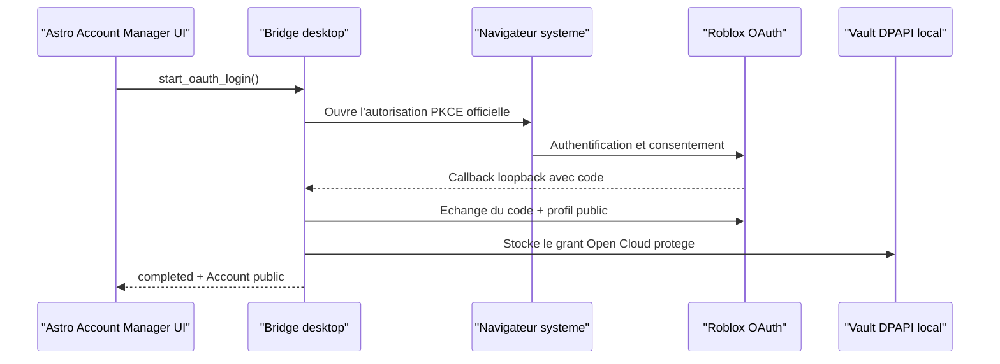

# Parcours de connexion Roblox

## Statut

Le parcours est implemente dans le bridge desktop d'Astro Account Manager. Le
bouton **Connect Roblox account** ne devient disponible qu'apres une
configuration OAuth valide. Le formulaire **Add local profile** reste un CRUD
de metadonnees locales : saisir un username ne cree ni session Roblox, ni
connexion navigateur, ni connexion du client de jeu.

Le mode Preview est volontairement different : il affiche la configuration
requise et ne simule jamais une connexion reussie.

## Entree dans le parcours

La page **Accounts** propose deux actions distinctes :

1. **Connect Roblox account** ouvre le navigateur systeme pour une
   autorisation Roblox Open Cloud officielle.
2. **Add local profile** cree uniquement une fiche locale (username, groupe,
   notes, couleur et favori).

Quand OAuth n'est pas pret, le premier bouton devient **Configure Roblox
sign-in** et dirige vers **Settings > Roblox sign-in**. Il ne lance pas de
flux factice.

## Configuration explicite

La page de parametres OAuth est disponible uniquement avec le bridge desktop.
Elle contient :

- l'activation explicite de la fonctionnalite ;
- le client ID Roblox numerique enregistre pour cette application ;
- l'URI loopback exact enregistre chez Roblox (par defaut
  `http://127.0.0.1:8989/oauth/callback`) ;
- un delai de callback borne entre 60 et 900 secondes.

Le client ID et l'URI sont des metadonnees de configuration. Aucun champ ne
demande de secret client, cookie, code OAuth, access token ou refresh token.
Le bridge refuse de demarrer OAuth tant que cette configuration n'est pas
valide.

## Deroulement de connexion officielle

Pendant l'attente, une modale indique que le navigateur systeme est ouvert et
interroge uniquement le statut public de l'operation. L'utilisateur peut
annuler ; fermer la modale ou presser Echap demande aussi l'annulation au
bridge plutot que de masquer une operation encore active. Une operation
terminee resynchronise les comptes avant de fermer la modale.

Les seuls statuts d'operation affiches sont `waiting`, `completed`,
`cancelled`, `expired` et `failed`. Un message de statut peut etre affiche,
mais aucune valeur d'authentification ne revient a JavaScript.

## Etats visibles par compte

| Etat UI | Source | Actions |
| --- | --- | --- |
| Profil local | `oauth_connected: false` | Organiser ou connecter via OAuth configure |
| Open Cloud OAuth lie | `oauth_connected: true` | Actualiser le grant ou le deconnecter localement |
| Autorisation en attente | Statut d'operation `waiting` dans la modale | Attendre ou annuler |
| Autorisation terminee | Statut `completed`, `cancelled`, `expired` ou `failed` | Fermer ou recommencer selon le resultat |

`oauth_expires_at` peut servir a informer l'interface d'une expiration, mais
reste une date publique. Le lien OAuth ne represente jamais une session de
client Roblox : il ne connecte pas le jeu, ne lit pas le navigateur et ne
produit pas de cookie de jeu.

La deconnexion demande une confirmation. Elle efface seulement le grant Open
Cloud protege localement et conserve la fiche, les groupes, les notes et les
favoris. Elle ne pretend pas deconnecter le navigateur ou un client Roblox.

## Contrat de bridge utilise

Ces methodes sont reservees au bridge desktop :

| Methode | Retour public |
| --- | --- |
| `start_oauth_login()` | `operation_id`, `status`, `expires_at`, `message` |
| `poll_oauth_login(operation_id)` | Meme statut ; `account` public uniquement quand `status` vaut `completed` |
| `cancel_oauth_login(operation_id)` | Statut terminal, normalement `cancelled` |
| `refresh_oauth_account(account_id)` | `Account` public actualise |
| `disconnect_oauth_account(account_id)` | `Account` public conserve, avec le lien OAuth retire |

Tous les retours sont redactes : ni cookie, ni code PKCE, ni access token, ni
refresh token, ni session de jeu ne sont exposes. Le contrat detaille est dans
[`app/frontend/BRIDGE_CONTRACT.md`](../app/frontend/BRIDGE_CONTRACT.md).

## Regles produit

- Dedoublonner une identite OAuth par son identifiant Roblox public stable,
  pas seulement par le username affiche.
- Ne jamais ecrire de grant, token, cookie ou secret dans SQLite de
  metadonnees, les exports, l'activite ou les diagnostics.
- Conserver le profil local si une autorisation echoue ; ne pas ecraser son
  organisation, ses notes ou ses favoris.
- Ne jamais presenter Preview comme une application desktop connectee, ni
  afficher un succes OAuth simule.
