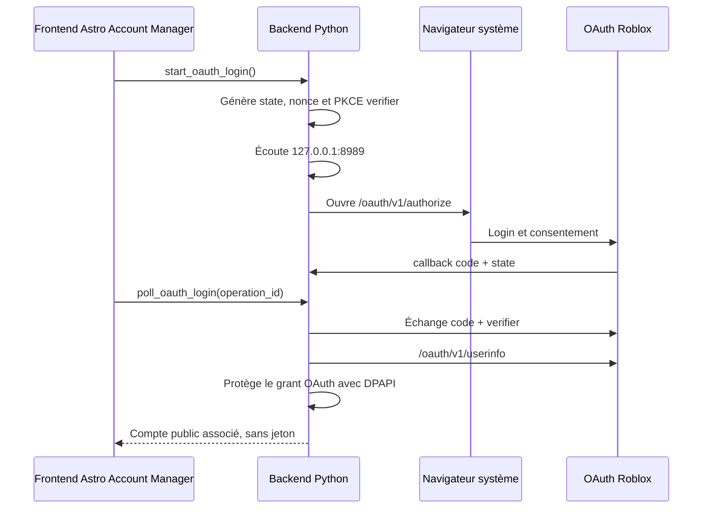

# Connexion Roblox OAuth (PKCE)

## Portée réelle

Astro Account Manager peut associer un profil Roblox à un compte local via le flux OAuth 2.0
officiel Roblox, avec PKCE et les scopes minimaux `openid profile`. Le flux
ouvre le **navigateur système** — Chromium lorsqu'il est le navigateur par
défaut — puis reçoit un callback court sur `127.0.0.1`.

Cette connexion est adaptée à :

- ajouter un compte depuis l'identité Roblox consentie ;
- récupérer le `user_id`, username, nom affiché et avatar public ;
- actualiser l'identité avec un refresh token OAuth tournant ;
- supprimer localement la connexion OAuth d'un compte.

Elle ne fait pas de l'application un login multi-compte du client Roblox. En
particulier, elle ne crée ni ne lit une session `.ROBLOSECURITY`, ne copie pas
de cookie, n'injecte aucune session dans `roblox://`, et ne modifie pas le
client Roblox. Les endpoints de profil/presence qui restent marqués `Cookie`
dans la référence Roblox ne deviennent pas accessibles par magie via les
scopes `openid profile`.

## Configuration requise

L'intégration est désactivée par défaut car un `client_id` Roblox et un URI de
retour enregistrés sont nécessaires. Dans le tableau de bord des credentials
Roblox, enregistrez exactement un callback loopback, par exemple :

```text
http://127.0.0.1:8989/oauth/callback
```

Puis fournissez, via les réglages avancés/bridge local, les valeurs suivantes :

```json
{
  "oauth": {
    "enabled": true,
    "client_id": "votre_client_id_numerique",
    "redirect_uri": "http://127.0.0.1:8989/oauth/callback",
    "callback_timeout_seconds": 300
  }
}
```

Le callback doit rester un URI HTTP sur `127.0.0.1`, avec le même port et le
même chemin que l'enregistrement Roblox. Astro Account Manager refuse les callbacks LAN ou
Internet, les URI avec fragment/query, et tout client secret : l'application
desktop est un client public et utilise PKCE.

## Flux



Le code d'autorisation est à usage unique et expire rapidement. Les valeurs
`state`, `nonce`, `code_verifier`, code, access token et refresh token ne
passent jamais par le bridge pywebview et ne sont jamais journalisées.

## Stockage et cycle de vie

- Le grant complet est enregistré dans `secret_vault_entries` sous
  `oauth_grant`, après chiffrement DPAPI `CurrentUser`.
- SQLite/public frontend ne contient que `oauth_connected`, une échéance et les
  scopes accordés ; aucun token n'y apparaît.
- `refresh_oauth_account(id)` utilise le refresh token local, enregistre sa
  rotation puis relit `/userinfo`.
- `disconnect_oauth_account(id)` supprime le grant local tout en conservant la
  fiche de compte et ses notes/groupes.
- Les exports Astro Account Manager retirent explicitement le marqueur OAuth : une exportation
  portable ne peut jamais prétendre qu'un compte importé est connecté.

## Références officielles Roblox

- [Implémentation OAuth 2.0 / PKCE](https://create.roblox.com/docs/cloud/auth/oauth2-develop)
- [Référence OAuth 2.0](https://create.roblox.com/docs/cloud/auth/oauth2-reference)
- [Scopes Open Cloud](https://create.roblox.com/docs/cloud/reference/scopes)
- [Référence profils utilisateur : exigences Cookie des endpoints concernés](https://create.roblox.com/docs/cloud/reference/features/user-profiles)

L'OAuth Roblox est documenté comme une fonctionnalité bêta : gardez la
configuration et les tests de connexion à jour lors des mises à jour Roblox.
