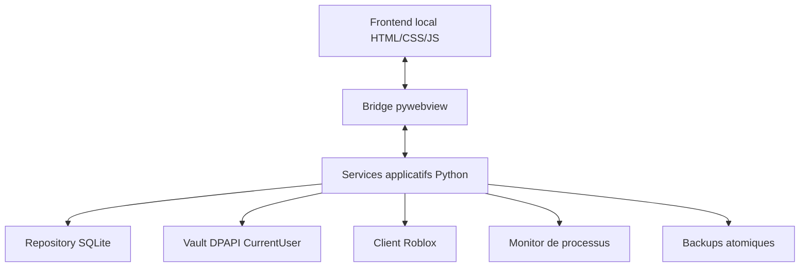

# Architecture

## Découpage

| Dossier | Responsabilité |
| --- | --- |
| `app/backend/core` | Configuration, erreurs et logs redacted. |
| `app/backend/models` | Modèles sérialisables sans secrets. |
| `app/backend/repositories` | Persistance SQLite et transactions. |
| `app/backend/security` | DPAPI, redaction et limites de secrets. |
| `app/backend/storage` | Backups, migration legacy et validation de fichiers. |
| `app/backend/roblox` | Client HTTP isolé, données de jeux/serveurs et lancement local. |
| `app/backend/watchers` | État des processus Roblox et règles locales opt-in. |
| `app/backend/services` | Règles métier coordonnées, notifications et activités. |
| `app/backend/api` | Bridge pywebview et API loopback optionnelle. |
| `app/frontend` | Application SPA et design system. |
| `tests` | Tests unitaires, intégration et migration. |

Le frontend n'implémente aucune règle métier et le backend ne rend aucun HTML. Toutes les méthodes bridge renvoient des structures JSON sans cookie, mot de passe ou ticket d'authentification.

