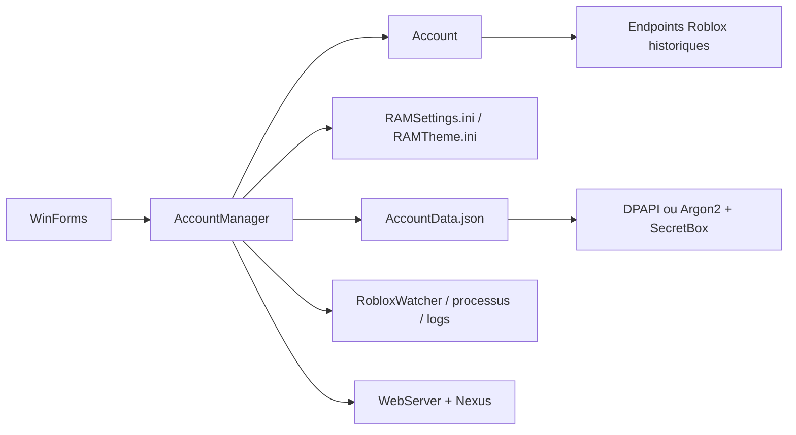
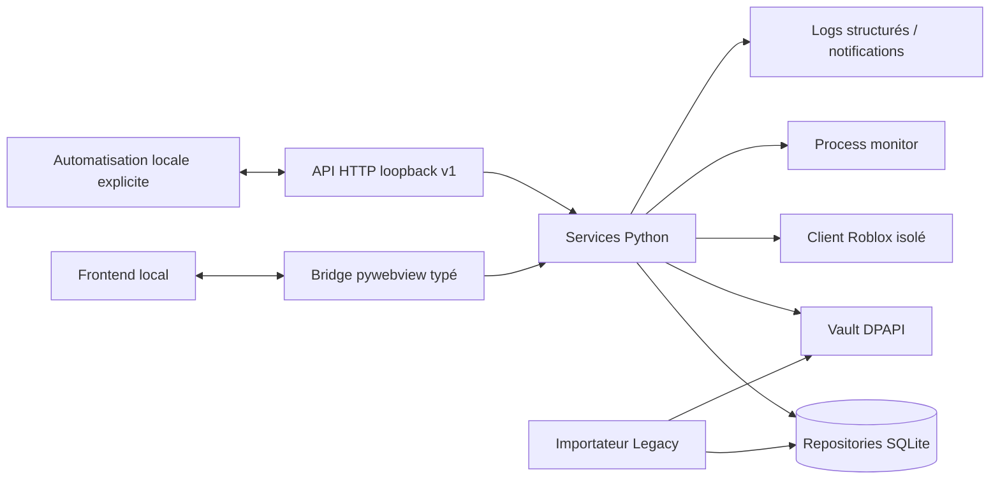

# Analyse du projet — Roblox Account Manager 3.7.2

> État de l'analyse : 10 août 2026  
> Référence fonctionnelle : `ic3w0lf22/Roblox-Account-Manager`, tag `3.7.2`, commit `79f61f3351df61fb3774dfa854ab868954da5389`  
> Référence locale distribuée : `Roblox.Account.Manager.3.7.2/Roblox Account Manager.exe` (SHA-256 `BE9DDCDEDF8C36C64E6B0A32D2686B74A112913C54217CCAA46675BFD1DC82F1`)

## Conclusion exécutive

Le dossier livré ne contient **aucun code source actif** : c'est une distribution Windows .NET Framework/WinForms compilée. Elle contient un exécutable MSIL, une configuration .NET, des réglages INI, une bibliothèque `libsodium.dll`, un journal et un magasin de comptes chiffré. Le dépôt source public correspondant a donc été utilisé comme référence fonctionnelle en lecture seule.

La nouvelle application est reconstruite indépendamment, sans réutiliser l'interface WinForms ni copier le code C#. Son noyau est Python, son application desktop est pywebview et son interface est un frontend local modulaire. Le binaire et les fichiers historiques restent intacts pendant toute la migration.

## État de reconstruction audité — 4.0.0a1

L'analyse ci-dessous reste le constat de la version 3.7.2 ; cet encadré décrit l'état réellement livré à la date d'audit. Le socle utilisable est présent sous `app/` :

- un point d'entrée pywebview (`main.py`), un bridge desktop redacted et un frontend local HTML/CSS/JS avec icônes Windows/SVG/PNG dédiées ;
- une base SQLite versionnée et transactionnelle pour les métadonnées, groupes, jeux, activité, notifications et préférences ;
- un vault DPAPI `CurrentUser` distinct de SQLite pour les sessions importées/ajoutées explicitement ;
- des backups versionnés avec manifeste SHA-256, vérification et restauration guidée : confirmation, backup pré-restauration, checkpoint/fermeture puis réouverture SQLite ;
- un importateur legacy non destructif pour les réglages, jeux et métadonnées de comptes, avec préflight backup et consentement séparé pour les secrets ;
- un transfert portable JSON de métadonnées publiques, atomique, checksummé et limité à 8 Mio ; l'import ne touche jamais le vault et crée un backup de sûreté ;
- un client Roblox public à délais/retry bornés, lecture de détails de jeux et serveurs publics, plus un lancement Windows validé via `roblox://` ;
- un monitor `psutil` local et borné, avec terminaison désactivée par défaut et confirmation/contrôle d'identité lorsqu'elle est activée ;
- une API HTTP `/api/v1` optionnelle, liée exclusivement à `127.0.0.1`, protégée par Bearer token en mémoire et documentée par OpenAPI ;
- des logs rotatifs avec redaction, diagnostics, activité et notifications persistés ;
- un build PyInstaller Windows réel contenant le frontend, le transfert de métadonnées et les icônes ; le prochain artefact est nommé `dist/AstroAccountManager.exe`.

La reconstruction reste en cours de parité : l’ajout OAuth/PKCE, les profils et la présence publics, les jeux récents/favoris, la découverte UWP, le monitor d’instances et le parseur de logs local sont désormais portés au moins partiellement. Les opérations historiques restantes sont conservées comme exigences dans la matrice, pas converties en « limitations connues » pour clore le projet. Le smoke test sur machine Windows propre, la signature et la validation manuelle WebView2 restent requis avant une diffusion. Les statuts détaillés et testables figurent dans [FEATURE_MATRIX.md](FEATURE_MATRIX.md) et le suivi source→équivalent dans [docs/PORTING_LEDGER.md](docs/PORTING_LEDGER.md).

## Architecture actuelle

| Couche | Implémentation historique | Constat |
| --- | --- | --- |
| Desktop | .NET Framework 4.8, WinForms, formulaire `AccountManager` | Logique métier, I/O, réseau et UI fortement mélangés. |
| Entrée | `Program.Main` + mutex mono-instance | Paramètres lus depuis le dossier de l'application. |
| Compte | `Account` sérialisé par Newtonsoft.Json | Modèle mutable avec effets de bord (sauvegarde depuis les setters). |
| Réseau | RestSharp, CefSharp, PuppeteerSharp | Endpoints Roblox historiques, appels souvent effectués depuis les handlers UI. |
| Stockage | `AccountData.json`, `RecentGames.json`, INI, fichiers locaux | Format sans version, sauvegarde parfois tardive, format de comptes chiffré ou non. |
| Sécurité | DPAPI, Sodium/Argon2 + SecretBox, secret optionnel | Bonne intention, mais choix de scope DPAPI incohérent et secrets aussi accessibles à certaines fonctions externes. |
| Processus | `RobloxWatcher`, `RobloxProcess`, UWP manager | Polling et analyse de logs Roblox couplés à l'UI. |
| API locale | `HttpListener` configurable | Capacités historiques incluent des opérations sensibles ; conception sans contrat/versionnement cohérent. |
| Automatisation | Nexus WebSocket/Lua | Comprend de l'exécution de commandes/scripts côté client : ne doit pas être repris tel quel. |

### Arborescence historique analysée

La source 3.7.2 contient notamment :

- `AccountManager.cs` : fenêtre principale, chargement/sauvegarde, import, lancement, menus contextuels et jeux récents.
- `Classes/Account.cs` : identité, session, profil, utilitaires de compte, lancement et opérations Roblox.
- `Forms/ServerList.cs` : serveurs, jeux, favoris, recherche de joueur, watcher et avatars.
- `Forms/AccountUtils.cs`, `AccountFields.cs`, `ImportForm.cs`, `RecentGamesForm.cs`, `ThemeEditor.cs`, `SettingsForm.cs` : outils secondaires.
- `Classes/RobloxWatcher.cs`, `RobloxProcess.cs`, `ClientSettingsPatcher.cs` : monitoring et réglages locaux du client.
- `Nexus/*` : contrôle WebSocket historique et panneau d'automatisation.
- `Classes/WebServer.cs` : serveur HTTP local historique.

## Dépendances historiques

- .NET Framework 4.8 / WinForms ; Newtonsoft.Json ; RestSharp ; log4net.
- CefSharp et PuppeteerSharp pour le navigateur/login historique.
- ObjectListView et FastColoredTextBox pour l'UI.
- Sodium (`libsodium-net`) pour Argon2 + SecretBox ; DPAPI Windows (`ProtectedData`).
- websocket-sharp, Yove.Proxy et Microsoft Windows API Code Pack.

### Dépendances cibles

- Python 3.12+ ; `pywebview 6.2.1` ; `requests` ; `psutil` ; `cryptography` ; `pytest`.
- SQLite standard library pour les métadonnées ; DPAPI Windows pour les secrets en local.
- Frontend HTML/CSS/JavaScript modulaire, servi localement par pywebview sans serveur à lancer manuellement.

## Flux de données historiques

### Flux cible

## Stockage et migration des données

### Formats détectés

| Fichier historique | Rôle | Traitement cible |
| --- | --- | --- |
| `AccountData.json` | Liste des comptes, sessions, groupes, champs, dates et métadonnées | Importé sans modifier l'original ; secrets séparés des métadonnées. |
| `AccountData.json.backup` | Copie de secours historique | Évaluée comme source de récupération si le primaire est illisible. |
| `RAMSettings.ini` | Réglages généraux, développeur, watcher, réseau | Converti vers réglages versionnés SQLite/JSON, avec validation. |
| `RAMTheme.ini` | Palette WinForms | Converti vers préférences de thème/tokens, jamais appliqué comme CSS arbitraire. |
| `RecentGames.json` | Jeux récents et favoris | Importé si présent dans le dossier source. |
| `log.txt` | Log log4net | Non importé par défaut ; peut être attaché aux diagnostics sur demande. |

### `AccountData.json`

Trois formes sont prises en charge par le code historique :

1. **DPAPI Windows** avec entropie statique ; l'exécutable peut lire sous l'utilisateur Windows concerné.
2. **Mot de passe optionnel** : en-tête RAM, sel Argon2 de 16 octets, nonce de 24 octets et chiffrement SecretBox.
3. **Texte JSON non chiffré** lorsque le marqueur `NoEncryption.IUnderstandTheRisks.iautamor` est présent.

Le schéma historique d'un compte inclut notamment identifiant, nom, cookie de session, validité, dates d'utilisation/rafraîchissement, alias, description, mot de passe mémorisé, groupe, champs arbitraires et identifiant de navigateur. Les secrets ne sont ni affichés dans l'analyse ni consignés dans les journaux.

### Risques détectés

- Le chargement historique DPAPI utilise `CurrentUser`, tandis que la sauvegarde utilise `LocalMachine` : cela peut rendre un fichier impossible à relire ou fragile après changement de contexte.
- Il n'y a pas de version de schéma ni de migration transactionnelle.
- La première sauvegarde peut créer un backup vide et la persistance est parfois différée.
- Des mots de passe, cookies et identifiants peuvent cohabiter dans la même charge sérialisée.
- Un réglage permet explicitement de désactiver le chiffrement.

### Stratégie cible

- Détection non destructive du dossier legacy ; copie de sauvegarde horodatée avant toute lecture de migration.
- Déchiffrement local uniquement sous le contexte Windows adéquat ; aucun secret n'est écrit dans les logs ou retourné au frontend.
- Import atomique dans SQLite : métadonnées en tables relationnelles, session/secret dans un vault DPAPI par entrée.
- Migration versionnée (`schema_migrations`), journal d'import et rapport de comptes ignorés/corrompus.
- Tentative secondaire sur le backup ; absence de suppression de fichiers anciens.

## APIs et intégrations Roblox historiques

Les familles suivantes sont observées dans le code source : identité/profil/avatar, présence, jeux et serveurs, authentification de session, amis/blocks, groupes, jeux récents, serveurs privés et lancement local. Les appels cibles seront encapsulés dans `backend/roblox/` avec : timeout, validation de réponse, limitation de débit, retry borné et erreurs normalisées.

Les APIs Roblox évoluent régulièrement. Les fonctionnalités publiques (métadonnées de jeux, avatars, listes de serveurs) seront séparées des opérations nécessitant une session et conçues pour échouer proprement sans casser l'UI.

### Capacités historiques requises, non portées à ce stade

| Capacité historique | État de portage constaté |
| --- | --- |
| Affichage/export brut de cookies, liens d'authentification ou API de récupération de cookie | **Requise, non portée**. Le contrat historique est inventorié dans la matrice ; aucune implémentation n'est déclarée livrée. |
| Automatisation de CAPTCHA / navigateur avec solver tiers | **Requise, non portée**. Le navigateur historique reste à inventorier et à porter séparément. |
| Nexus : injection/exécution de scripts arbitraires dans des clients Roblox | **Requise, non portée**. Les transports, messages et dépendances historiques sont consignés dans le registre de portage. |
| Patch/bypass de restrictions multi-instance du client | **Requise, non portée**. La stratégie historique et ses prérequis restent à évaluer avant toute intégration. |

Ces lignes restent des exigences de conversion explicites dans [FEATURE_MATRIX.md](FEATURE_MATRIX.md) : elles ne sont ni marquées comme terminées ni retirées du périmètre par la documentation.

## Bugs et problèmes d'architecture détectés

1. Persistance sans version ni transaction ; backup incomplet possible.
2. Mismatch DPAPI `CurrentUser`/`LocalMachine` et option de stockage non chiffré.
3. Réseau, UI et règles métier fusionnés dans de très grands formulaires.
4. Appels réseau synchrones/handlers `async void` qui exposent l'application à des blocages, courses et erreurs non centralisées.
5. Formats d'API historiques, sans client typé ni contrat d'erreur commun.
6. Polling watcher et lecture de logs sans modèle d'état cohérent ; états de processus orphelins possibles.
7. Paramètres INI non validés, logique de redémarrage éparse et absence de réinitialisation granulaire robuste.
8. API locale permissive configurable et fonctionnalités de contrôle distant trop puissantes.
9. Navigateur embarqué lourd et dépendances natives importantes.
10. UI WinForms non responsive, thème dispersé et ergonomie faible pour un grand nombre de comptes.

## Fonctionnalités à préserver et améliorer

La liste exhaustive est dans [FEATURE_MATRIX.md](FEATURE_MATRIX.md). Les familles de priorité sont :

- comptes, groupes, import/export, sauvegarde/restauration ;
- jeux, favoris, récents, serveurs et lancement ;
- processus, instances, watcher et diagnostics ;
- préférences, thème, raccourcis, recherche et notifications ;
- API locale documentée et bridge pywebview.

## Nouvelles fonctionnalités proposées

- Dashboard configurable et activité récente persistée.
- Command palette, recherche globale, vue carte/tableau, sélection multiple et opérations bulk.
- Journal de notifications et diagnostics consultables, avec redaction automatique.
- Base SQLite transactionnelle, backup planifié, validation d'intégrité et restauration guidée.
- Thèmes dark/light avec tokens, accent personnalisable, densité et reduced motion.
- API locale opt-in, loopback uniquement, versionnée et sans lecture de secrets.
- Réglages catégorisés, validation, reset par rubrique ou global, raccourcis personnalisables.

## Plan de migration

1. Établir la matrice fonctionnelle et les critères d'acceptation.
2. Créer la structure Python/pywebview et le socle d'erreurs/logs/configuration.
3. Implémenter le stockage SQLite, vault DPAPI, backups et importateur legacy.
4. Isoler le client Roblox, les jeux/serveurs et le lancement local.
5. Implémenter le monitor de processus et les règles locales de récupération.
6. Exposer un bridge pywebview stable et une API locale opt-in.
7. Construire le design system, dashboard, gestionnaire de comptes/groupes, jeux, serveurs, diagnostics et paramètres.
8. Ajouter tests unitaires/intégration/migration, documentation et packaging Windows.
9. Auditer la matrice et documenter les limitations réelles.

## Critères de sortie

- Aucun fichier legacy n'est perdu ou réécrit pendant l'import.
- Aucun secret n'apparaît dans logs, notifications, export de diagnostic ou API locale.
- Tous les éléments marqués « terminé » dans la matrice sont couverts par un test ciblé.
- `python main.py` lance une application desktop sans serveur à démarrer manuellement.
- Le build Windows embarque le runtime nécessaire et se vérifie sur une installation propre.
